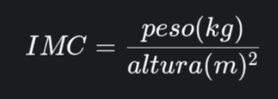

# Projeto de Detecção de Diabetes com Machine Learning


Este projeto demonstra um fluxo de trabalho completo de Machine Learning para a detecção de diabetes. Ele inclui scripts para gerar dados sintéticos, treinar um modelo de classificação, avaliar sua performance e, por fim, usar o modelo treinado para fazer previsões em novos dados de pacientes.

##  Estrutura do Projeto

```
.
├── csv/
│   └── diabetes_data.csv       # (Gerado) Dataset com 1000 amostras de pacientes
├── model/
│   └── modelo_diabetes.joblib    # (Gerado) O modelo de ML treinado e salvo
├── scaler/
│   └── scaler.joblib             # (Gerado) O scaler ajustado e salvo
├── gerar_csv.py                # Script para criar o dataset sintético
├── treinar_modelo.py             # Script para treinar, avaliar e salvar o modelo
├── fazer_previsao.py             # Script para usar o modelo salvo e prever novos dados
├── requirements.txt              # Lista de dependências do projeto
└── README.md                     # Este arquivo
```

## Dicionário de Dados

O modelo é treinado com base em 8 características clínicas de um paciente. Abaixo está a descrição detalhada de cada uma delas.

### `pregnancies` (Gestações)
* **O que é:** O número de vezes que a pessoa esteve grávida.
* **Como é obtido:** Pergunta direta ao paciente durante a consulta médica (anamnese).
* **Relevância:** Múltiplas gestações e a ocorrência de diabetes gestacional são fatores de risco conhecidos para o desenvolvimento de diabetes tipo 2.

### `glucose` (Glicose)
* **O que é:** O nível de açúcar no plasma sanguíneo, geralmente após um jejum de 8 horas (Glicemia de Jejum). Medido em mg/dL.
* **Como é obtido:** Exame de sangue laboratorial.
* **Relevância:** É o principal indicador para o diagnóstico de diabetes. Níveis cronicamente elevados são a principal característica da doença.

### `blood_pressure` (Pressão Arterial)
* **O que é:** A pressão arterial diastólica (o número "menor" da medição, ex: 80 em "120/80 mmHg").
* **Como é obtido:** Medida com um esfigmomanômetro (aparelho de pressão).
* **Relevância:** Hipertensão é uma comorbidade comum em pacientes diabéticos e ambas as condições elevam o risco cardiovascular.

### `skin_thickness` (Espessura da Prega Cutânea)
* **O que é:** A espessura da dobra da pele na região do tríceps, em milímetros.
* **Como é obtido:** Medida com um adipômetro. É um método para estimar a gordura corporal.
* **Relevância:** Funciona como um indicador da gordura subcutânea. Níveis elevados de gordura corporal são um fator de risco para a resistência à insulina.

### `insulin` (Insulina)
* **O que é:** O nível do hormônio insulina no sangue, medido em µU/mL.
* **Como é obtido:** Exame de sangue específico, geralmente coletado em jejum.
* **Relevância:** Pode indicar resistência à insulina. No início do diabetes tipo 2, o corpo pode produzir níveis muito altos de insulina para tentar compensar.

### `bmi` (IMC - Índice de Massa Corporal)
* **O que é:** Um índice que relaciona o peso com a altura, calculado pela fórmula: `peso (kg) / (altura (m) * altura (m))`.
* **Como é obtido:** Medição de peso e altura do paciente.
* **Relevância:** É o principal indicador de sobrepeso e obesidade, que são os maiores fatores de risco para o desenvolvimento de diabetes tipo 2.



### `pedigree` (Função de Pedigree de Diabetes)
* **O que é:** Uma função que calcula uma pontuação representando o risco genético de diabetes com base no histórico familiar.
* **Como é obtido:** Não é um exame, mas um cálculo baseado em um questionário sobre a saúde dos parentes do paciente.
* **Relevância:** A predisposição genética é um fator de risco bem estabelecido.

### `age` (Idade)
* **O que é:** A idade do paciente em anos.
* **Como é obtido:** Pergunta direta ao paciente.
* **Relevância:** O risco de desenvolver diabetes tipo 2 aumenta significativamente com a idade, especialmente após os 45 anos.

## Como Usar

### Pré-requisitos
* Python 3.8 ou superior
* `pip` e `venv`

### Instalação

1.  **Clone o repositório:**
    ```bash
    git clone <URL_DO_SEU_REPOSITORIO>
    cd <NOME_DA_PASTA_DO_PROJETO>
    ```

2.  **Crie e ative um ambiente virtual:**
    ```bash
    # Para Linux / macOS
    python3 -m venv venv
    source venv/bin/activate

    # Para Windows
    python -m venv venv
    .\venv\Scripts\activate
    ```

3.  **Instale as dependências:**
    O arquivo `requirements.txt` já está no projeto. Execute o comando abaixo para instalar tudo o que é necessário.
    ```bash
    pip install -r requirements.txt
    ```

### Execução do Projeto

> **Importante:** Antes de executar, certifique-se de que os caminhos dos arquivos dentro dos scripts (`.py`) correspondem à nova estrutura de pastas. Por exemplo, o caminho para o dataset em `treinar_modelo.py` deve ser `'csv/diabetes_data.csv'`, o caminho para salvar o modelo deve ser `'model/modelo_diabetes.joblib'`, e assim por diante.

Siga os passos na ordem correta:

1.  **Gerar os Dados de Treinamento:**
    Este comando criará o arquivo `diabetes_data.csv` dentro da pasta `csv/`.
    ```bash
    python gerar_csv.py
    ```

2.  **Treinar o Modelo:**
    Este script usará o `.csv` gerado, treinará o modelo, exibirá as métricas de performance e salvará os artefatos nas pastas `model/` e `scaler/`.
    ```bash
    python treinar_modelo.py
    ```

3.  **Fazer uma Nova Previsão:**
    Use o modelo treinado para prever o resultado para um novo paciente. Você pode editar os dados do `novo_paciente` dentro do script para testar diferentes perfis.
    ```bash
    python fazer_previsao.py
    ```

## Resultados do Modelo
O script `treinar_modelo.py` avalia o modelo treinado e exibe as seguintes métricas no console:
-   **Acurácia:** A porcentagem geral de acertos.
-   **Relatório de Classificação:** Detalha a Precisão, Recall e F1-Score para cada classe (Diabético e Não Diabético).
-   **Matriz de Confusão:** Uma tabela e um gráfico que visualizam os acertos e erros do modelo.

## Licença
Este projeto está licenciado sob a Licença MIT.